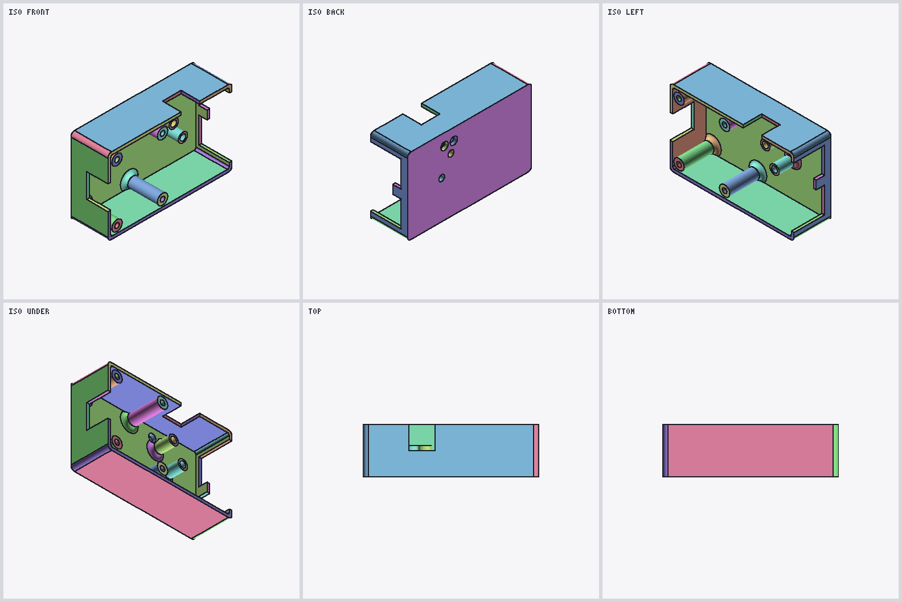
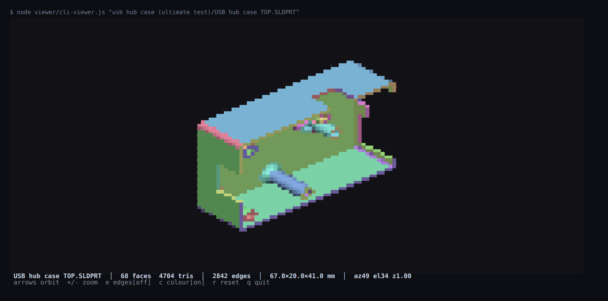

# SLDPRT Reverse-Engineering Research
**Latest, 2026-09-16:** [v0.4.8 / EXP-042–051](v0.4.8/README.md) decodes the triangle-strip layout, Block1 edge-ID annotations, Block2 section lengths and the downstream metadata relationship on the modern corpus, then validates that decode three independent ways — against externally exported STEP, through a second face-discovery path with a falsification control, and visually. [parser/](parser/README.md) implements the validated read-only path. This supersedes the old “loop size” interpretation; full exact B-rep and several metadata semantics remain open. All work goes to `staging`; the user merges to `main`.


This is a research project to recover the serialization grammar of the SolidWorks SLDPRT binary format.
### [JOIN THE DISCUSSION WITH US ON DISCORD](https://discord.gg/vC4Jee5Q4n "join our discussion and share findings/breakthroughs")
This is **not** a production converter. The old converter code (`src/`, `test/`) was removed in v0.4.0 to focus purely on format research. The goal is to understand the format well enough to build a full toolkit.

dump of all the progress is [right here](https://github.com/blussyya/sldprt-research-dump "all the files produced and used for this project, including the sldprt files used.")

## What's Decoded

Two layers of the `Contents/DisplayLists` per-face record are now read end to end, and the
link between them is explicit:

- **A precursor array** `[4,8,2,S]` immediately before the positions stores the **triangle-strip
  vertex counts** directly, one entry per strip, summing to the face's vertex count (INV-020).
  This is what `parser/v0.2` reads as `stripLengths`.
- **Block2** is the **Block1 section-length table**, one entry per strip, storing `2·L − 2` — the
  strip's leading control word plus its `2L − 3` edge tokens — and summing to Block1's word count
  (INV-018). A strip length is recoverable from it as `(Block2[i] + 2) / 2`, which is INV-007's
  decode and what `parser/v0.1` used; what that decode yields is strip vertex counts, not the CAD
  boundary-loop sizes the old `loopSizes` name implied. **Block2's stored words are not strip
  lengths** — every stored word exceeds its strip length (`2L − 2` against `L`, for the observed
  `L ≥ 3`), so reading them as lengths produces invalid triangle indices.
- **Block1** is a **per-edge annotation array** over those strips: one control word per strip,
  then one token per strip edge. Zero marks a face-interior edge, nonzero a face-boundary edge,
  and the nonzero IDs are shared with the adjoining face (INV-021, INV-024).
- This *explains* INV-016/017 rather than restating them: a strip of L vertices has exactly
  2L−3 edges, so `b1Len = 2 × (vc − secCount)` falls out of the strip model.
- A third byte array (Block3, INV-022) and a forward metadata grammar reaching the surface
  record and edge table (INV-023) are documented but not fully decoded.

Still open: exact B-rep, feature history, `Config-0-Partition`, Block3 semantics, the optional
scalar arrays, and surface tags 4005/4006/4007/4009 — the controlled corpus covers only planes
and cylinders, recorded as NQ-030. Legacy OLE2 containers remain unsupported.

## Knowledge Base

The project-wide knowledge base is maintained under `knowledge/`:

| File | Purpose |
|------|---------|
| `RESEARCH_HANDOFF.md` | Compact operational handoff for fresh agentic sessions or to get a quick look in general, read this first |
| `KNOWN_INVARIANTS.md` | Verified structural properties demonstrated across the corpus |
| `EXPERIMENT_LOG.md` | Ledger of every experiment with facts, hypotheses, and confidence |
| `FAILED_HYPOTHESES.md` | Hypotheses that have been disproven |
| `OPEN_QUESTIONS.md` | Broad unresolved questions |
| `NEXT_QUESTIONS.md` | Concrete operational research queue |
| `ASSUMPTIONS.md` | Working assumptions |
| `FORMAT_TIMELINE.md` | Version and container observations |
| `EVIDENCE_PRESERVATION_POLICY.md` | Rules for reproducible evidence |
| `evidence/` | Archived raw experiment outputs |
| `RESEARCH_DASHBOARD.md` | Current research posture |

## Research Versions

| Version | Description |
|---------|-------------|
| v0.4.7 | Block1/Block2 token-semantics investigation on the controlled corpus (EXP-027–EXP-041). Includes the 2026-08-14 archivist audit, EXP-038's NQ-028 answer via C12, the EXP-039/EXP-040 corrections, and EXP-041 — the first from-source verification of the whole v0.4.7 record after the C00–C11 binaries were added. |
| v0.4.8 | Triangle-strip and edge-ID decode (EXP-042–046), cone metadata validated against externally exported STEP (EXP-047/048), independent replication with a falsification control (EXP-049), resolution of the off-cone residuals (EXP-050), and visual validation of parser output (EXP-051). Promotes INV-020–024, supersedes the “loop size” interpretation, and corrects the interpretive layer of INV-002/007/019 and EXP-031–036. |

> **Note:** The `v0.5` slot was an implementation (a parser), not a research version. It now lives under `parser/v0.1/` — see below.

## Parser

The parser is versioned independently from the research progression and lives under `parser/`:
V0.2 is nested in the root of `parser/`

| Version | Description |
|---------|-------------|
| `parser/v0.1` | Read-only SLDPRT geometry parser & browser viewer, originally produced as research slot `v0.5`. Built on the validated state through v0.4.6; passes exact parity (1,172/1,172 faces) against the v0.4.5/v0.4.6 reference data. See `parser/v0.1/README.md` and `parser/v0.1/SUMMARY.md`. |
| `parser/` | Read-only parser implementing the verified strip/edge layout and forward metadata read (v0.4.8, EXP-042–046). Returns triangle indices, boundary cycles, edge IDs and linked metadata; retains unknown data and original coordinates. Not a converter. See `parser/README.md` and `v0.4.8/PARSER_V02_VALIDATION.json`. |


## Parser Output

Renders produced directly from `parser/` output by `v0.4.8/exp051_render_validation.js`
(EXP-051) - a self-contained software rasteriser with no external dependencies, consuming the
parser's own `triangleIndices` and `edgeAnnotations` verbatim. Nothing is re-derived, welded or
repaired: **what these images show is what the parser emits.** Black lines are the edges whose
Block1 annotation is nonzero (INV-021's boundary edges), drawn onto the mesh.

Each sheet is six viewpoints - ISO front/back/left, ISO under, top, bottom.

**C10, the 1 mm shell** - the controlled model that pins the strip triangulation. The TOP view
resolves the opening as a clean square annulus with the interior floor visible through it;
BOTTOM shows a closed base. A fan triangulation or a mis-ordered strip would close or web
across the opening.


**USB hub case TOP** — 68 faces, 4,704 triangles: enclosure walls, cutout, screw bosses,
counterbored holes and lip, coherent from every angle.



All eleven sheets are in [`v0.4.8/EXP051_renders/`](v0.4.8/EXP051_renders), all the files used here are available in the [dump repo](https://github.com/blussyya/sldprt-research-dump/tree/main/test%20files%20original/):

| controlled | production |
|---|---|
| [C03 fillet](v0.4.8/EXP051_renders/C03.png) · [C04 hole](v0.4.8/EXP051_renders/C04.png) · [C07 two holes](v0.4.8/EXP051_renders/C07.png) · [C10 shell](v0.4.8/EXP051_renders/C10.png) | [USB hub TOP](v0.4.8/EXP051_renders/usbtop.png) · [USB hub BOTTOM](v0.4.8/EXP051_renders/usbbottom.png) · [Pocket Wheel](v0.4.8/EXP051_renders/pocket.png) · [Dekor](v0.4.8/EXP051_renders/dekor.png) · [Helical Bevel Gear](v0.4.8/EXP051_renders/gear.png) · [distributor](v0.4.8/EXP051_renders/distributor.png) · [PTC GE8080-8](v0.4.8/EXP051_renders/ptc.png) |

Regenerate with `node v0.4.8/exp051_render_validation.js --all`. Scope and limits — this
validates the display mesh, not the CAD surfaces, and asserts no tolerance — are recorded in
[the EXP-051 evidence file](knowledge/evidence/2026-09-16_v0.4.8-EXP051.md).

## Project Structure

```
sldprt-format-research/
├── README.md
├── knowledge/                           # Project-wide research knowledge base
│   ├── ASSUMPTIONS.md
│   ├── EVIDENCE_PRESERVATION_POLICY.md
│   ├── EXPERIMENT_LOG.md
│   ├── FAILED_HYPOTHESES.md
│   ├── FORMAT_TIMELINE.md
│   ├── KNOWN_INVARIANTS.md
│   ├── NEXT_QUESTIONS.md
│   ├── OPEN_QUESTIONS.md
│   ├── RESEARCH_DASHBOARD.md
│   ├── RESEARCH_HANDOFF.md
│   └── evidence/                        # Archived raw experiment outputs, strip/edge layout + forward metadata read (v0.4.8)
│
├── parser/                              # Parser implementation (own versioning; not research versions)
│   ├── v0.1/                            # Read-only SLDPRT parser & viewer (was research slot v0.5)
│   │   ├── src/                         # parser-core.js (isomorphic) + node-cli.js
│   │   ├── test/                        # Corpus parity + v0.4.5 reference comparison
│   │   ├── web/                         # Browser viewer (three.js/pako)
│   │   ├── README.md
│   │   ├── SUMMARY.md
│   │   └── package.json
│   ├── src/                         # parser-core.js (isomorphic) + node-cli.js
│   ├── test/                        # validate.js
│   ├── README.md
│   └── package.json
│
├── viewer/                              # Interactive viewers (see viewer/README.md)
│   ├── cli-viewer.js                    # ANSI truecolor terminal viewer
│   ├── web/index.html                   # browser viewer (hand-written WebGL, drag-and-drop)
│   ├── inflate.js                       # synchronous DEFLATE, so the parser runs client-side
│   ├── test-inflate.js                  # verifies inflate.js against Node's zlib
│   ├── export-mesh-data.js              # geometry payload for the browser viewer
│   ├── mesh-data.json
│   └── renders/                         # screenshots used in the READMEs
│
├── v0.4.6/                              # EXP-026 secCount/header correlation hunt
├── v0.4.7/                              # Token-semantics investigation (EXP-027–EXP-041)
└── v0.4.8/                              # Strip/edge decode & validation (EXP-042–EXP-051)
    ├── exp042_strip_layout.js … exp051_render_validation.js
    ├── research-common.js
    ├── EXP042_RESULTS.json … EXP051_RENDER_INDEX.json
    ├── EXP051_renders/                  # 11 six-view contact sheets from parser/v0.2
    ├── PARSER_V02_VALIDATION.json
    ├── REPRODUCTION.json
    └── README.md
```


## Using the tools

Node.js only. **No dependencies to install** — no npm install, no build step, nothing fetched at
runtime. Everything below runs from a fresh clone. Legacy OLE2 parts are unsupported throughout
and report `No readable modern DisplayLists stream`.

### 1. Parse a part file

```bash
node parser/src/node-cli.js "test files original/controlled/C04_cube_hole_5mm/model.SLDPRT" > parsed.json
```

Prints the whole decode as JSON — one object per face carrying `stripLengths`, `vertices`,
`normals`, `triangleIndices`, `edgeAnnotations` (the INV-021 per-edge tokens), `block1/2/3`,
`boundaryCycles` and the forward `metadata` with its surface tag and parameters. Byte `offsets`
are included per face so any claim can be checked against the file itself. Exits nonzero if any
face failed.

Validation:

```bash
node parser/test/validate.js           # per-face strip/edge/metadata report
```

### 2. Render contact sheets (PNG)

Six viewpoints per model — ISO front/back/left, ISO under, top, bottom — written as one 3×2 sheet.

```bash
node v0.4.8/exp051_render_validation.js --sheet "path/to/YourPart.SLDPRT"   # one model
```

output defaults to `v0.4.8/EXP051_renders/<name>.png`; pass a second path to redirect it
this is a self-contained rasteriser with its own PNG encoder
Black lines are Block1 boundary edges drawn onto the mesh.

### 3. Interactive terminal viewer

```bash
node viewer/cli-viewer.js "test files original/controlled/C10_cube_shell_1mm/model.SLDPRT"
```



That is the actual terminal output. Rendering uses ANSI truecolor and the half-block character
`▀` — the foreground paints the upper pixel, the background the lower — so one character row is
two pixels tall and the raster is `columns × rows×2`. Needs a truecolor terminal (Windows
Terminal, iTerm2, most Linux terminals); it adapts to the window size and redraws on resize.

| key | action |
|---|---|
| arrows or `h` `j` `k` `l` | orbit |
| `+` `-` | zoom |
| `e` | boundary edges on/off |
| `c` | colour by face on/off |
| `r` | reset view |
| `q` | quit |

Flags: `--still` (one frame, no input — works when piped), `--dark`, `--edges` / `--no-edges`.
The edge overlay defaults on only in windows tall enough to resolve it; see
[`viewer/README.md`](viewer/README.md) for why.

## License

MIT
