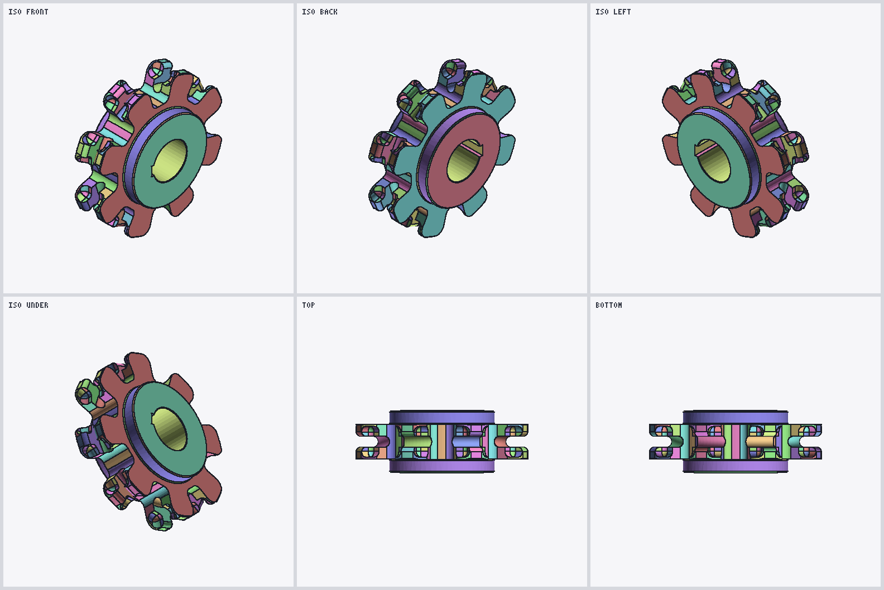
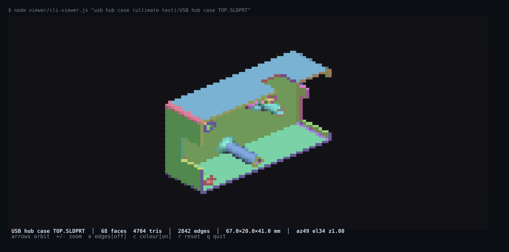

# SLDPRT format research

Reverse engineering SolidWorks `.SLDPRT` part files, because the format is not documented anywhere
and that pissed me off.

This repository has two parts. **`sldprt`** is a dependency-free Node.js package and CLI that reads
part files without SolidWorks. **[`docs/`](docs/README.md)** is a written-up description of the
format as far as it is understood, with every claim checked against a corpus of real files.

### [Join the discussion on Discord](https://discord.gg/vC4Jee5Q4n)

## What it reads

| layer | status | details |
|---|---|---|
| Container, modern (SolidWorks 2015+) | ✅ read, CRC-checked | [container.md](docs/format/container.md) |
| Container, legacy OLE2 (SolidWorks 2011) | ✅ read | [container.md](docs/format/container.md#legacy-container-ole2) |
| Display mesh: triangles, normals, boundary edges | ✅ modern and 2011 | [displaylists.md](docs/format/displaylists.md) |
| Per-face surface type, parameters, analytic bounding box | ✅ modern; box also 2011 | [displaylists.md](docs/format/displaylists.md#surface-record-modern) |
| Native Parasolid B-rep: topology, analytic and B-spline geometry | ✅ parsed and graph-checked, modern and 2011 | [parasolid.md](docs/format/parasolid.md) |
| Mesh ↔ B-rep link (face and edge IDs) | ✅ 1,414 / 1,414 faces | [parasolid.md](docs/format/parasolid.md#the-join-with-the-display-mesh) |
| STL export | ✅ exact copy of the saved mesh | [validation.md](docs/validation.md#stl-and-step-export-display-mesh) |
| STEP export | ⚠️ planes exact, curved faces faceted. Exact STEP from the B-rep is in progress | [open-questions.md](docs/open-questions.md) |
| Feature tree, sketches, configurations, assemblies | ❌ not decoded | |
| Pre-2011 parts | ❌ refused with an explicit error | [container.md](docs/format/container.md#what-is-not-read) |

## Quick start

Node 18 or newer. No `npm install` needed: there are no dependencies.

```sh
git clone https://github.com/blussyya/sldprt-format-research
cd sldprt-format-research
node bin/sldprt.js info samples/sw2022/C04_cube_hole_5mm.SLDPRT
```

```
container   modern (SolidWorks 2015+), 62408 bytes
DisplayLists version 15000
streams     38
display     7 faces, 152 triangles (modern DisplayLists)
surface tags 4001×6  4002×1
partition   Contents/Config-0-GhostPartition: partition (complete)
partition   Contents/Config-0-Partition: partition + deltas (complete)
B-rep       186 nodes from Contents/Config-0-Partition: 1 body, 2 shell, 7 face, 10 loop, 14 edge, 8 vertex
surfaces    plane×6  cylinder×1
graph checks 367 run, 0 failed
```

To get a `sldprt` command, run `npm link` once.

| command | does |
|---|---|
| `sldprt info part.SLDPRT` | what is in the file |
| `sldprt parse part.SLDPRT > mesh.json` | the display mesh and surface records as JSON |
| `sldprt convert part.SLDPRT --stl out.stl --step out.step` | export (`--ascii`, `--faceted`, `--scale N`) |
| `sldprt brep part.SLDPRT` | the native Parasolid body: node census and graph checks (`--json`, `--nodes`) |
| `sldprt render part.SLDPRT sheet.png` | six-view PNG contact sheet |
| `sldprt view part.SLDPRT` | interactive viewer in the terminal |
| `sldprt serve --open` | browser viewer; files are parsed locally and never uploaded |

`samples/` has four small parts to try: three SolidWorks 2022 and one SolidWorks 2011.


*A SolidWorks 2011 part (1 mm shell), straight from its legacy DisplayLists stream. Black lines are
the edges Block1 marks as face boundaries.*



*Pocket Wheel: 400 faces, 17,078 triangles. What the parser read, unwelded and unrepaired.*



*`sldprt view` in a truecolor terminal.*

### From code

```js
const fs = require('fs'), sldprt = require('./src');   // or require('sldprt')

const mesh = sldprt.parse('part.SLDPRT');         // faces: vertices, triangleIndices, edge IDs, surface type…
const body = sldprt.readBrep('part.SLDPRT');      // native Parasolid nodes + graph checks
fs.writeFileSync('part.stl', sldprt.toSTL('part.SLDPRT'));
```

The display reader also runs in the browser; see [docs/api.md](docs/api.md).

## How good is it

Measured against a corpus of 73 part files. 49 of them were built for this project to dimensions
fixed in advance, in SolidWorks 2011 and 2022, and each was exported by SolidWorks to STEP, STL,
X_T and X_B with its per-face surface types recorded. A few highlights from
[validation.md](docs/validation.md):

- 73 / 73 files parse exactly as the recorded golden output; 1,559 faces.
- Face counts equal SolidWorks' own on every controlled model, in both versions.
- Surface tags equal SolidWorks' reported surface types on 136 / 136 faces.
- All 98 Parasolid exports and all 70 readable embedded bodies parse to the end with 0 graph-check
  failures. The decoded C00 cube has its corners exactly at 0 and 10 mm.
- Exported STL has the exact bounding box of SolidWorks' STL on all 13 controlled cubes, and exact
  volume on the planar ones. SolidWorks' own STL of three of them is missing a face; this one is
  not.

Run it yourself:

```sh
git clone https://github.com/blussyya/sldprt-research-dump ../sldprt-research-dump   # the corpus
npm test
```

## Limits

- It reads; it does not write SLDPRT.
- STEP output of curved faces is faceted until the exact B-rep writer lands.
- Verified on SolidWorks 2011 and 2022 files and 21 production parts of unrecorded versions. Other
  versions probably work for the modern container, but that is not demonstrated.
- Single parts only. No assemblies, drawings or feature history.
- Inputs are bounded (128 MiB, 2 million vertices, 50,000 faces) and malformed data is refused, but
  this has not been security-audited.

## Repository layout

```
bin/sldprt.js         the CLI
src/                  the package
  container/          modern.js (stream scan, CRC), ole.js (CFB reader)
  display.js          DisplayLists reader (isomorphic)
  inflate.js          DEFLATE/zlib for the browser
  parasolid/          partition.js, xt.js (transmit reader), topology.js
  convert.js          STL / STEP writer
  render.js           PNG contact sheets
  terminal-viewer.js  sldprt view
  serve.js            sldprt serve
web/                  browser viewer
samples/              four small parts
test/                 node:test suites; fixtures/display-golden.json
docs/                 the format, validation, history, open questions
```

## Research

The raw ledger lives in **[sldprt-research-dump](https://github.com/blussyya/sldprt-research-dump)**:
every experiment (EXP-001 to EXP-074) with its script, raw output and later corrections, the full
test corpus, and every earlier parser and converter version. This repository keeps only the
current code and the cleaned-up result. The superseded `parser/v0.1`, `parser/v0.2`,
`converter/v0.1`, `parser/v0.3`, `viewer/` and research folders `v0.4.6`–`v0.4.8` are preserved
there.

[docs/history.md](docs/history.md) tells the story in a page, including the parts that went wrong.

## License

MIT. The Parasolid layer follows the published *Parasolid XT Format Reference* (2006). No
SolidWorks or Parasolid source code, binaries or SDK files are used.
